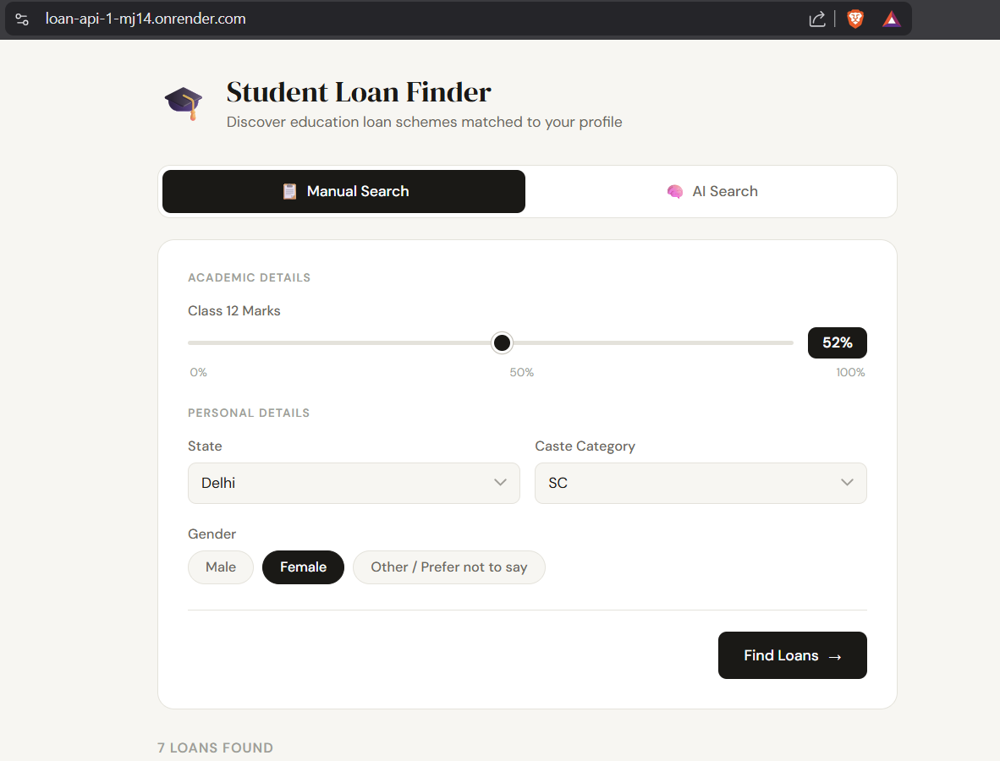
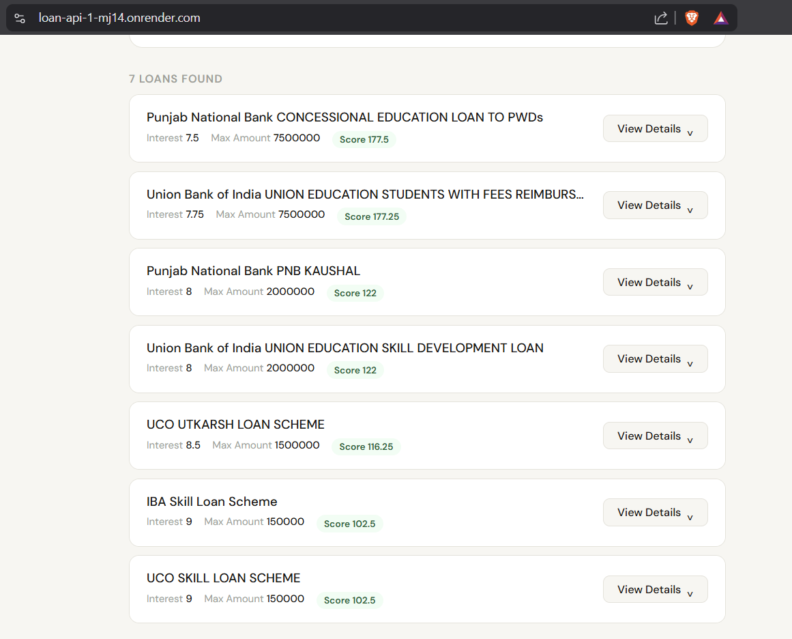
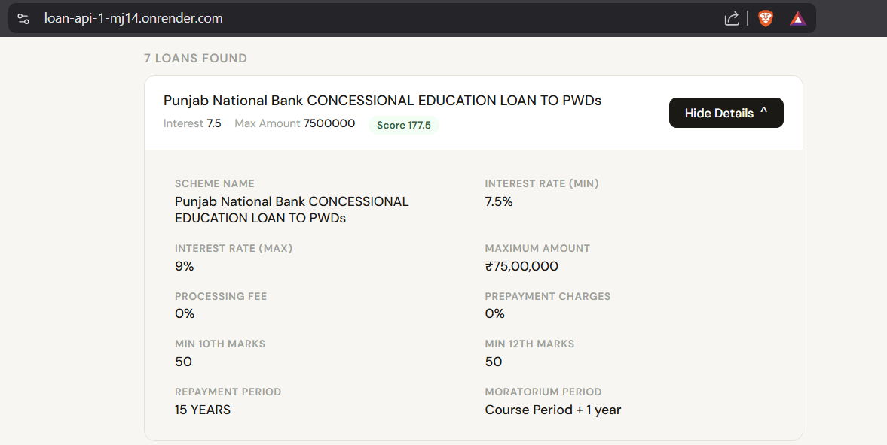
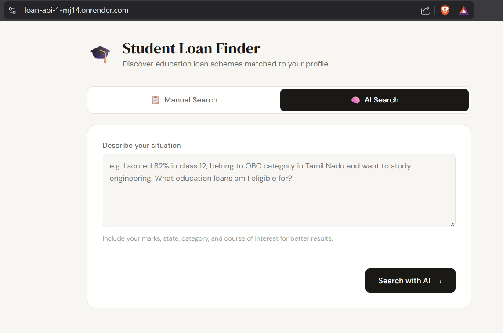
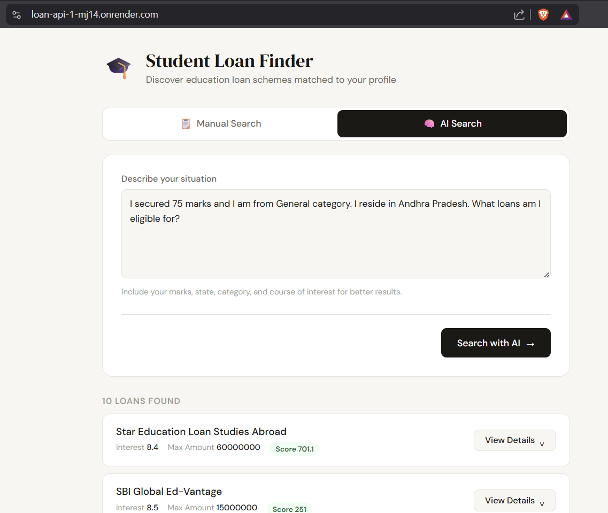

# 🎓 Student Loan Recommendation System

## 🌐 Live Demo

* 🔗 Frontend: https://loan-api-1-mj14.onrender.com
* ⚙️ Backend API: https://loan-api-f8sd.onrender.com/docs

---

### 📸 Screenshots

<p align="center">
  
  <br>
  <em>Home Page with Manual Search</em>
</p>

<p align="center">
  
  <br>
  <em>Filtered loans</em>
</p>

<p align="center">
  
  <br>
  <em>More info about loan</em>
</p>

<p align="center">
  
  <br>
  <em>AI search interface for user written prompts</em>
</p>

<p align="center">
  
  <br>
  <em>Loans found for given prompt</em>
</p>

---

## 🚀 Overview

An AI-powered full-stack system that recommends student loan schemes based on eligibility and financial criteria.

Users can either:

* Enter details manually (marks, state, caste, gender)
* Ask in natural language (e.g., *“I got 85% in Tamil Nadu and belong to OBC”*)

---

## 🔥 Features

### 🧠 AI-Powered Search

* Uses Groq LLM to extract structured data from user queries
* Converts natural language into filters

### 🧾 Smart Filtering System

* Hard filters (eligibility):

  * 10th/12th marks
  * State
  * Caste
  * Gender

* Soft ranking (intelligent scoring):

  * Lower interest rate preferred
  * Higher loan amount preferred
  * Lower processing fee preferred

### 📊 Loan Ranking Engine

* Custom scoring algorithm
* Returns top recommendations sorted by score

### 🔍 Detailed View

* Click on any loan → view full scheme details

---

## 🧱 Tech Stack

* **Backend:** FastAPI
* **Database:** PostgreSQL (Neon)
* **ORM:** SQLAlchemy
* **AI Integration:** Groq (LLM)
* **Frontend:** HTML, CSS, JavaScript
* **Deployment:** Render

---

## 📌 API Endpoints

### 🔹 Filter Loans

```id="a1"
GET /loans/filter
```

### 🔹 Loan Details

```id="a2"
GET /loans/{loan_id}
```

### 🔹 AI Query

```id="a3"
GET /genai?query=your_text
```

---

## 🧠 Architecture

```text id="a4"
User Input (Text / Form)
        ↓
GenAI (Groq)
        ↓
Extract Parameters
        ↓
FastAPI Backend
        ↓
Hard Filtering (SQL)
        ↓
Soft Scoring (Python)
        ↓
Top Loan Results
```

---

## 🎯 Key Highlights

* Full-stack application with real-world use case
* Integration of LLM with backend APIs
* Clean separation of filtering and ranking logic
* Deployed and publicly accessible system

---

## 🚀 Future Improvements

* Add authentication system
* Improve scoring algorithm with weights
* Add more filters (income, course type)
* Enhance UI/UX

---

## 👨‍💻 Author

Praneeth Sangnal
